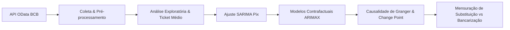

Gemini
Nova conversa
Pesquisar conversas
Estudantes
Imagens
Vídeos
Biblioteca
Gems
Novo notebook
Fundamentals of Machine Learning and Transformer Architecture
The Quiet Revolution of Starting Over
Todos os notebooks
Código Cronograma Gantt Pix
Impacto Financeiro da Privatização da Sabesp
Como Aplicar Dicas Práticas
Canais do YouTube para IA
Criação de Planilha de Compras
Sem título
50 Dicas de Produtividade e Bem-Estar
Peça da Enfermeira da Raiva
Resumo de Vídeo sobre E-commerce
Otimização de Produtos para Shopee
Produtividade Local com Gemma 4
Como Funciona uma Rede Neural
Busca por Gemini na Vila Sônia
Entendendo o Paper do Kimi
Lembrete do Remédio Infantil
Tabela de Produtos Faber-Castell
Retorno Financeiro de Canal Pequeno
Mochila com zíper quebrado
Casas Bahia: Dívidas e Recuperação Judicial
Lucro Short Casas Bahia Seis Anos
Custo de um Prato de Comida
Custo de Telhas para 6x6 Metros
Nescafé Original vs. Matinal: Diferenças
Caderno de Distribuição Normal
Homem Verde em Desespero Hospitalar
Combinar Cores de Acessórios Sociais
Agressão e Busca por Ajuda
Orçamento de IA da Uber Esgotado
Ghost Shift: Construindo Riqueza Silenciosa
Aba Anotações no Microsoft Teams
Resumo de Pipelines de Dados e Orquestração
Conversa com o Gemini
preciso fazer um readme para o git com esse documento

Etapa 1: Concepção do Produto e Organização ..... [04/08/2026 - 31/08/2026] (Concluído)
Etapa 2: Caracterização e Técnicas .............. [01/09/2026 - 28/09/2026]
Etapa 3: Modelagem e Implementação Parcial ...... [29/09/2026 - 26/10/2026]
Etapa 4: Análise Crítica e Entrega Final ....... [27/10/2026 - 30/11/2026]


---

## ⚙️ Metodologia & Pipeline

```mermaid
flowchart LR
    A[API OData BCB] --> B[Coleta & Pré-processamento]
    B --> C[Análise Exploratória & Ticket Médio]
    C --> D[Ajuste SARIMA Pix]
    D --> E[Modelos Contrafactuais ARIMAX]
    E --> F[Causalidade de Granger & Change Point]
    F --> G[Mensuração de Substituição vs Bancarização]
🌍 Impacto e Sustentabilidade (ODS/ONU)
Este trabalho contribui para a agenda de desenvolvimento sustentável da ONU:

ODS 8 — Trabalho Decente e Crescimento Econômico

ODS 9 — Indústria, Inovação e Infraestrutura

ODS 11 & 16

📚 Referências Principais
BALAN, P.; KLOTZLE, M. C.; NORDEN, L. Fast payment systems and deposit dynamics: evidence from Brazil's Pix. SSRN, 2026.

FERREIRA, A. R. Arranjo Pix: regulação e concorrência em pagamentos digitais. Revista da PGBC, 2022.

SAMPAIO, M. C.; ORNELAS, J. R. H. Payment technology complementarities and their consequences in the banking sector: evidence from Brazil's Pix. Banco Central do Brasil, Working Paper 600, 2024.

SCHAPIRO, M. G.; MOUALLEM, P. S. B.; DANTAS, E. G. PIX: explaining a state-owned Fintech. Brazilian Journal of Political Economy, 2023.

UNITED STATES TRADE REPRESENTATIVE (USTR). Section 301 Investigation Reports on Brazil Digital Payment Services. Federal Register, 2025-2026.
"""

with open("README.md", "w", encoding="utf-8") as f:
f.write(readme_content)

print("FILE_CREATED: README.md")


```text?code_stdout&code_event_index=1
FILE_CREATED: README.md

Seu arquivo README.md formatado para o GitHub está pronto!

Ícone do app MD
README
 MD 
Aberto
📄 Conteúdo do README.md gerado:
Markdown
# Previsão de Crescimento e Mensuração do Efeito de Substituição do Pix sobre os Meios de Pagamento Concorrentes no Brasil

> **Projeto Aplicado IV — Curso de Ciência de Dados**  
> **Universidade Presbiteriana Mackenzie** (São Paulo, 2026)

---

## 👥 Integrantes da Equipe

- **Cainã Fernandes Guimarães da Silva**
- **Gabriel de Oliveira Meloni**
- **Humberto Guttau Bravo**
- **Jimmy Paiva Gomes**

---

## 📌 Visão Geral do Projeto

Este projeto insere-se na área de **Ciência de Dados aplicada a séries temporais financeiras**, com foco na modelagem estatística da adoção tecnológica do **Pix** (sistema de pagamentos instantâneos do Banco Central do Brasil) e na quantificação de seus efeitos de substituição e complementaridade em relação a outros instrumentos de pagamento concorrentes (*boleto bancário, cheque, TED/DOC e cartões de crédito e débito*).

### 🎯 Problema de Pesquisa
> **Em que medida o Pix efetivamente substituiu cada um dos meios de pagamento concorrentes, e em que medida ele os complementou por meio da expansão da base de usuários bancarizados?**

---

## 💡 Motivação e Contexto

1. **Digitalização e Disputa Internacional:**
   - Em 2025/2026, o Escritório do Representante Comercial dos EUA (USTR) iniciou investigações (Seção 301 do *Trade Act*) questionando a atuação do Banco Central do Brasil como operador e regulador do Pix, alegando prejuízos à competitividade de empresas norte-americanas de cartões e pagamentos.
2. **Substituição vs. Bancarização (Complementaridade):**
   - Embora o Pix tenha substituído diretamente transferências tradicionais (TED/DOC, cheques e boletos), dados da Abecs apontam que o setor de cartões movimentou R$ 4,5 trilhões em 2025 (+10,1% em relação a 2024, com alta de 14,5% em cartões de crédito).
   - O Pix atuou como um vetor de inclusão financeira, ampliando o acesso a contas digitais e injetando novos usuários no ecossistema de pagamentos.
3. **Achados Preliminares (Ticket Médio):**
   - Análise da série temporal (nov/2020 a jul/2026) mostra a queda do ticket médio por transação Pix de **~R$ 880 (nov/2020)** para **~R$ 400 (2023)**, estabilizando-se em um platô de **R$ 380 a R$ 450**, evidenciando a incorporação de transações do dia a dia e novos casos de uso populares.

---

## 🎯 Objetivos

- [x] **a) Previsão do Pix:** Modelar a trajetória de adoção em volume e quantidade via ARIMA/SARIMA.
  - *Status:* Modelo base `SARIMA(0,1,0)(0,1,1,12)` ajustado e validado.
- [ ] **b) Cenários Contrafactuais:** Construir modelos `ARIMAX` com variável de intervenção para estimar a trajetória projetada dos concorrentes (sem Pix) vs. observada.
- [ ] **c) Validação Estatística:** Aplicar testes de **Causalidade de Granger** e detecção de **Pontos de Mudança Estrutural** (*change point detection*).

---

## 📊 Descrição das Bases de Dados

As fontes são primárias, públicas e consumidas via **API OData (Plataforma Olinda)** do Banco Central do Brasil:

| Endpoint / Fonte | Granularidade / Período | Observações | Status |
| :--- | :--- | :--- | :---: |
| **`EstatisticasTransacoesPix`** | Mensal (Nov/2020 – Jul/2026) | 69 obs. Microdados por 9 variáveis categóricas agregadas por mês. | 🟢 Coletado |
| **`MeiosdePagamentosMensalDA`** | Mensal (Nov/2020 – Jul/2026) | 69 obs. Volumes/valores de Pix, TED, Cheque, Boleto e DOC (DOC zerado após descontinuação). | 🟢 Coletado |
| **`Quantidadeetransacoesdecartoes`** | Trimestral (4Q20 – 1Q26) | 22 obs. Estoque e transações de cartões de crédito e débito. | 🟢 Coletado |
| **`MeiosdePagamentosTrimestralDA`** | Trimestral | Falha no servidor do BCB (Erro 500 para todos os 22 trimestres). | 🟡 Pendente (Fallback: Abecs) |

---

## 🗓️ Cronograma do Projeto

Etapa 1: Concepção do Produto e Organização ..... [04/08/2026 - 31/08/2026] (Concluído)
Etapa 2: Caracterização e Técnicas .............. [01/09/2026 - 28/09/2026]
Etapa 3: Modelagem e Implementação Parcial ...... [29/09/2026 - 26/10/2026]
Etapa 4: Análise Crítica e Entrega Final ....... [27/10/2026 - 30/11/2026]


O Gemini é uma IA e pode cometer erros.

Analisando
# Previsão de Crescimento e Mensuração do Efeito de Substituição do Pix sobre os Meios de Pagamento Concorrentes no Brasil

> **Projeto Aplicado IV — Curso de Ciência de Dados**  
> **Universidade Presbiteriana Mackenzie** (São Paulo, 2026)

---

## 👥 Integrantes da Equipe

- **Cainã Fernandes Guimarães da Silva**
- **Gabriel de Oliveira Meloni**
- **Humberto Guttau Bravo**
- **Jimmy Paiva Gomes**

---

## 📌 Visão Geral do Projeto

Este projeto insere-se na área de **Ciência de Dados aplicada a séries temporais financeiras**, com foco na modelagem estatística da adoção tecnológica do **Pix** (sistema de pagamentos instantâneos do Banco Central do Brasil) e na quantificação de seus efeitos de substituição e complementaridade em relação a outros instrumentos de pagamento concorrentes (*boleto bancário, cheque, TED/DOC e cartões de crédito e débito*).

### 🎯 Problema de Pesquisa
> **Em que medida o Pix efetivamente substituiu cada um dos meios de pagamento concorrentes, e em que medida ele os complementou por meio da expansão da base de usuários bancarizados?**

---

## 💡 Motivação e Contexto

1. **Digitalização e Disputa Internacional:**
   - Em 2025/2026, o Escritório do Representante Comercial dos EUA (USTR) iniciou investigações (Seção 301 do *Trade Act*) questionando a atuação do Banco Central do Brasil como operador e regulador do Pix, alegando prejuízos à competitividade de empresas norte-americanas de cartões e pagamentos.
2. **Substituição vs. Bancarização (Complementaridade):**
   - Embora o Pix tenha substituído diretamente transferências tradicionais (TED/DOC, cheques e boletos), dados da Abecs apontam que o setor de cartões movimentou R$ 4,5 trilhões em 2025 (+10,1% em relação a 2024, com alta de 14,5% em cartões de crédito).
   - O Pix atuou como um vetor de inclusão financeira, ampliando o acesso a contas digitais e injetando novos usuários no ecossistema de pagamentos.
3. **Achados Preliminares (Ticket Médio):**
   - Análise da série temporal (nov/2020 a jul/2026) mostra a queda do ticket médio por transação Pix de **~R$ 880 (nov/2020)** para **~R$ 400 (2023)**, estabilizando-se em um platô de **R$ 380 a R$ 450**, evidenciando a incorporação de transações do dia a dia e novos casos de uso populares.

---

## 🎯 Objetivos

- [x] **a) Previsão do Pix:** Modelar a trajetória de adoção em volume e quantidade via ARIMA/SARIMA.
  - *Status:* Modelo base `SARIMA(0,1,0)(0,1,1,12)` ajustado e validado.
- [ ] **b) Cenários Contrafactuais:** Construir modelos `ARIMAX` com variável de intervenção para estimar a trajetória projetada dos concorrentes (sem Pix) vs. observada.
- [ ] **c) Validação Estatística:** Aplicar testes de **Causalidade de Granger** e detecção de **Pontos de Mudança Estrutural** (*change point detection*).

---

## 📊 Descrição das Bases de Dados

As fontes são primárias, públicas e consumidas via **API OData (Plataforma Olinda)** do Banco Central do Brasil:

| Endpoint / Fonte | Granularidade / Período | Observações | Status |
| :--- | :--- | :--- | :---: |
| **`EstatisticasTransacoesPix`** | Mensal (Nov/2020 – Jul/2026) | 69 obs. Microdados por 9 variáveis categóricas agregadas por mês. | 🟢 Coletado |
| **`MeiosdePagamentosMensalDA`** | Mensal (Nov/2020 – Jul/2026) | 69 obs. Volumes/valores de Pix, TED, Cheque, Boleto e DOC (DOC zerado após descontinuação). | 🟢 Coletado |
| **`Quantidadeetransacoesdecartoes`** | Trimestral (4Q20 – 1Q26) | 22 obs. Estoque e transações de cartões de crédito e débito. | 🟢 Coletado |
| **`MeiosdePagamentosTrimestralDA`** | Trimestral | Falha no servidor do BCB (Erro 500 para todos os 22 trimestres). | 🟡 Pendente (Fallback: Abecs) |

---

## 🗓️ Cronograma do Projeto

```
Etapa 1: Concepção do Produto e Organização ..... [04/08/2026 - 31/08/2026] (Concluído)
Etapa 2: Caracterização e Técnicas .............. [01/09/2026 - 28/09/2026]
Etapa 3: Modelagem e Implementação Parcial ...... [29/09/2026 - 26/10/2026]
Etapa 4: Análise Crítica e Entrega Final ....... [27/10/2026 - 30/11/2026]
```

---

## ⚙️ Metodologia & Pipeline



---

## 🌍 Impacto e Sustentabilidade (ODS/ONU)

Este trabalho contribui para a agenda de desenvolvimento sustentável da ONU:
- **ODS 8 — Trabalho Decente e Crescimento Econômico**
- **ODS 9 — Indústria, Inovação e Infraestrutura**
- **ODS 11 & 16**

---

## 📚 Referências Principais

- BALAN, P.; KLOTZLE, M. C.; NORDEN, L. **Fast payment systems and deposit dynamics: evidence from Brazil's Pix**. SSRN, 2026.
- FERREIRA, A. R. **Arranjo Pix: regulação e concorrência em pagamentos digitais**. Revista da PGBC, 2022.
- SAMPAIO, M. C.; ORNELAS, J. R. H. **Payment technology complementarities and their consequences in the banking sector: evidence from Brazil's Pix**. Banco Central do Brasil, Working Paper 600, 2024.
- SCHAPIRO, M. G.; MOUALLEM, P. S. B.; DANTAS, E. G. **PIX: explaining a state-owned Fintech**. Brazilian Journal of Political Economy, 2023.
- UNITED STATES TRADE REPRESENTATIVE (USTR). **Section 301 Investigation Reports on Brazil Digital Payment Services**. Federal Register, 2025-2026.
README.md
Exibindo README.md.
